# BCT3005 Fundamentals of Fog and Edge Computing Project

## Simple 3 Tier Architecture Network Simulation and Task Scheduling Algorithm

### Overview

This project focuses on the fundamentals of Fog and Edge Computing by implementing a network simulation and task scheduling algorithm for a Simple 3 Tier Architecture. The simulation is designed with specific assumptions to address the challenges posed by the increasing data generated by IoT devices, with a particular emphasis on medical use cases.

### Assumptions

1. **Elastic Cloud Node:**
   - The Cloud node is assumed to be elastic up to a certain point. This means that the Cloud node can dynamically scale its resources to handle increased workloads, but there is a limit to this elasticity.

2. **Limited Resources for Fog Nodes:**
   - Fog nodes, being closer to the edge, are assumed to have limited resources. This limitation necessitates efficient task scheduling and resource management to ensure optimal performance.

3. **Response Time Priority:**
   - In emergency situations, response time is considered an extremely valuable metric. The system is designed with a focus on minimizing response times, especially for medical use cases where timely actions can be critical.

4. **Evaluation Metrics:**
   - The model's performance is assessed based on two primary metrics: 
     - **Cost:** The cost associated with task processing, considering the resources utilized by both Fog and Cloud nodes.
     - **Response Time:** The time taken to respond to client requests, with a specific emphasis on meeting the critical response time requirements in emergency scenarios.

### Features

- **Network Simulation:** The project includes a simulation of a Simple 3 Tier Architecture, comprising client, Fog, and Cloud layers. This network simulation enables a comprehensive understanding of the communication dynamics within the architecture.

- **Task Scheduling Algorithms:**
  - **Priority Based Scheduling (PB):**
    - Priority scheduling is a method of scheduling processes based on priority. The scheduler selects tasks to work as per their priority, and tasks with higher priority are carried out first.
    - In our model, tasks are assigned priorities ranging from 1 to 10, with 1 being the least important and 10 being extremely important.
    - Tasks with priority < 5 are scheduled only at the Cloud node to save on costs, as they are considered less important.
    - Fog and Cloud nodes sort tasks by priority and execute them one at a time. If a higher priority task arrives at a Fog node, it sends a lower priority task to the Cloud node for processing immediately to avoid waiting for the slower and memory-limited Fog node to finish.
  - **Shortest Job First (SJF):**
    - SJF or shortest job next is a scheduling policy that selects the waiting process with the smallest execution time to execute next. It is a non-preemptive algorithm.
    - SJF has the advantage of having a minimum average waiting time among all scheduling algorithms and is considered a Greedy Algorithm.
    - It may cause starvation if shorter processes keep coming, a problem that can be mitigated using the concept of ageing.

- **Medical Use Cases:** The project is tailored to address the specific requirements of medical use cases. By focusing on healthcare scenarios, the implementation aims to showcase the relevance and effectiveness of Fog and Edge Computing in improving response times and overall system performance.

### Observations

- **Cost vs. Execution Time Tradeoff:**
  - It can be observed from the above-depicted graph that 'Priority Scheduling in Fog' costs less than 'Shortest Job First Scheduling in Fog.' However, it is essential to note that it trades off the execution time for the cost.

- **SJF + Priority as a Middle Ground:**
  - 'SJF + Priority' emerges as a sweet middle ground, striking a balance between achieving even response times and managing costs effectively.

- **SJF in Emergency Situations:**
  - SJF proves highly useful when no priority is assigned to tasks, making it suitable for scenarios where there are no emergency situations. However, it may not be the optimal choice in medical use cases where prioritizing tasks based on urgency is critical.

### Conclusion

The proposed hybrid method provides a solid way to schedule tasks in a simple fog architecture and can be further studied to improve optimization with state-of-the-art techniques like SWARM optimization. This study on Task Scheduling has imparted valuable insights into implementing fog and demonstrated how applying task scheduling can drastically impact the final outcome. The findings underscore the importance of striking a balance between response times and costs, especially in scenarios where critical response times are imperative, such as in medical emergencies.

### Future Work

- **Optimization Techniques:**
  - Further exploration of advanced optimization techniques, including SWARM optimization, can enhance the efficiency of the proposed hybrid method.

- **Real-world Implementation:**
  - Applying the findings from this simulation to real-world scenarios, especially in the healthcare domain, can provide valuable insights into practical applications and challenges.

### How It Works

1. **Client-Server Communication:** Clients communicate with the Fog layer, which acts as an intermediary between the client and the Cloud layer.

2. **Fog Layer Processing:** The Fog layer processes tasks requested by clients, optimizing response times by bringing the Cloud environment physically closer.

3. **Task Scheduling:** The simulation incorporates multiple task scheduling algorithms, each offering a distinct approach to managing and prioritizing tasks within the Fog layer.

4. **Metrics Evaluation:** The model's performance is assessed based on cost and response time, taking into account the assumptions of limited resources for Fog nodes and the elasticity of the Cloud node.

### Results

Below is a screenshot showcasing the results of our simulation:

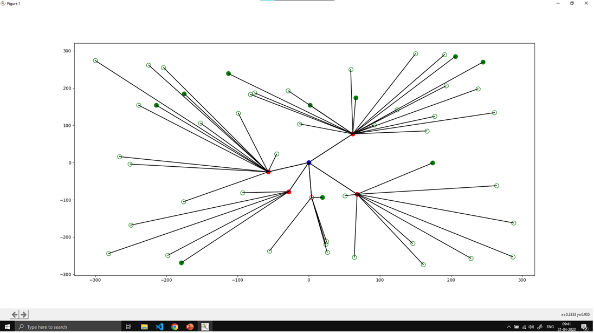
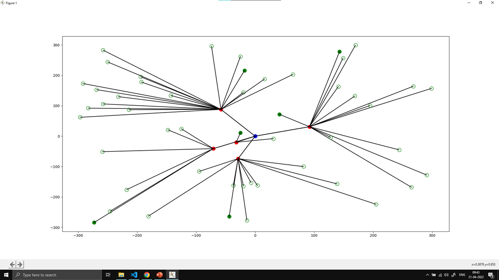

## Priority
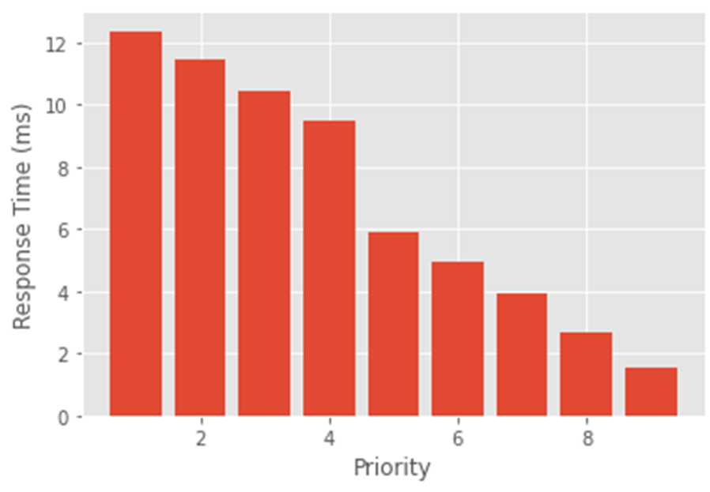
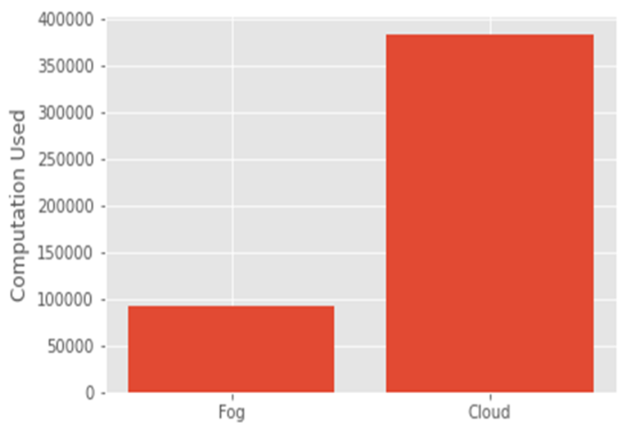
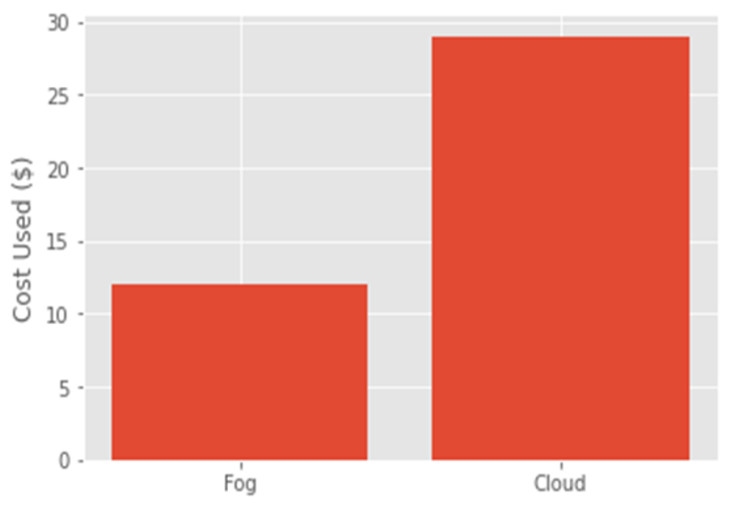

## SJF
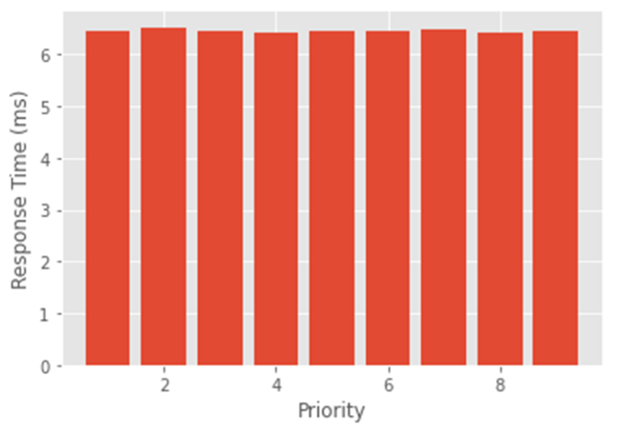
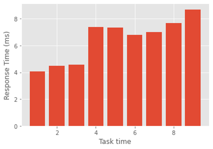
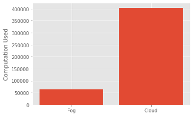
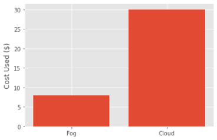

## SJF + Priority {Proposed}
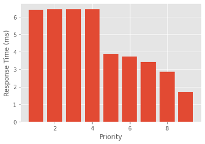
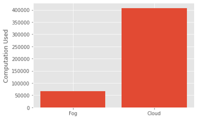
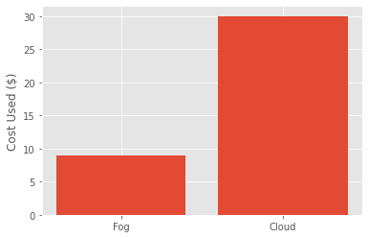

### License

This project is licensed under the MIT License - see the LICENSE file for details.